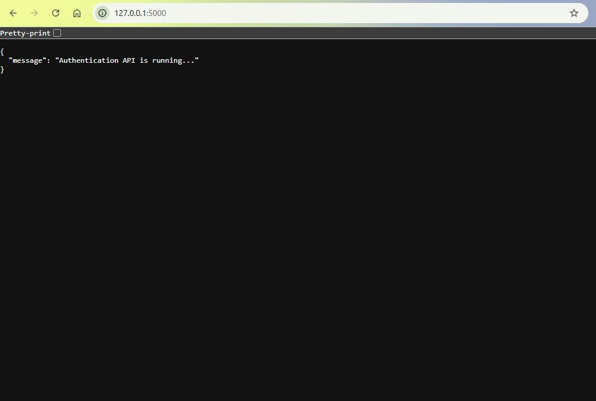
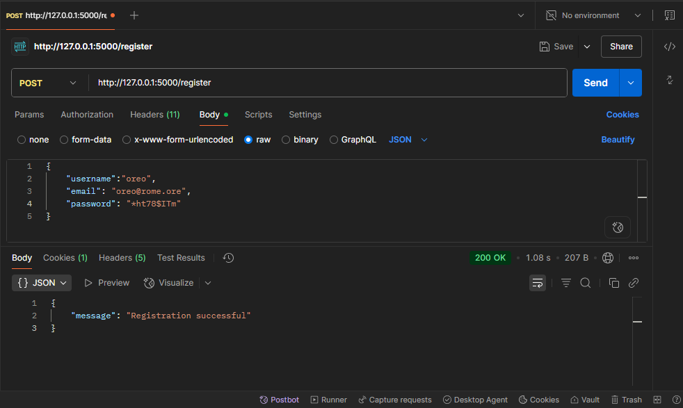
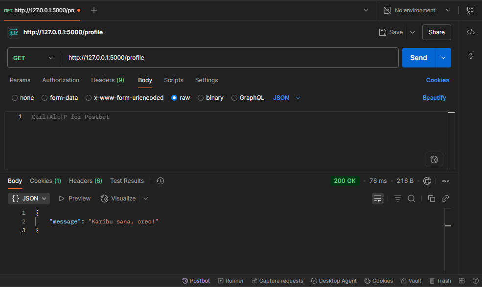

# Stanbic Backend Hackathon Challenge 3: Authentication
P.S. This README file is edited and formatted with the help of GitHub Copilot 🙂

This is an **Authentication API** built with Python/Flask and SQLite to support user registration and login with email and password.

## 🌟 Features

- **User Registration** with email and username
- **Secure Login** with bcrypt password hashing
- **Password Validation** (8+ characters, uppercase, lowercase, numbers, special characters)
- **Session Management** for authenticated users
- **Welcome Message** in Swahili upon successful login
- **SQLite Database** DB engine for local data storage with SQLAlchemy ORM layer
- **Session Expiration** Flask session set to expire after 1 hour

## 🔨 Tools
- **VS Code IDE**
- **Postman**
- **GitLab**

## 🏗️ Project Structure

```
MiniHackathon-project/
├── authenticator.py          # Main API file with routes
├── requirements.txt          # Project dependencies
├── README.md                # Project documentation
├── .env                     # Environment variables 
├── .gitignore              # Git ignore file
├── screenshots/
└── instance/
    └── userinfo.db         # SQLite database (created automatically)
```

## 🛠️ API Routes

- `GET /` - To test that API is running successfully
- `POST /register` - For user registration
- `POST /login` - For user login
- `GET /profile` - Protected route that is accessed after successful login

## 📋 Dependencies

### Core Framework
- **Flask (3.1.1)** - Lightweight web framework for building the API
- **Werkzeug (3.1.3)** - WSGI utility library (Flask dependency)

### Database & ORM
- **Flask-SQLAlchemy (3.1.1)** - Flask extension for SQLAlchemy ORM
- **SQLAlchemy (2.0.41)** - Database toolkit and ORM
- **greenlet (3.2.3)** - Lightweight coroutines for SQLAlchemy

### Authentication & Security
- **Flask-Bcrypt (1.0.1)** - Flask extension for bcrypt password hashing
- **bcrypt (4.3.0)** - Password hashing library for secure authentication

### Environment & Configuration
- **python-dotenv (1.1.1)** - Load environment variables from .env files

### Utilities
- **click (8.1.8)** - Command line interface creation toolkit
- **blinker (1.9.0)** - Signal/event dispatching library
- **itsdangerous (2.2.0)** - Secure data serialization
- **Jinja2 (3.1.6)** - Template engine
- **MarkupSafe (3.0.2)** - String handling library for templates

### System Dependencies
- **colorama (0.4.6)** - Cross-platform colored terminal text
- **importlib_metadata (8.7.0)** - Library metadata access
- **typing_extensions (4.14.1)** - Type hints backport
- **zipp (3.23.0)** - Pathlib-compatible object wrapper

## 🚀 Installation & Setup

### 1. Clone the Repository
```bash
git clone <repository-url>
cd MiniHackathon-project
```

### 2. Create Virtual Environment
```bash
# Create virtual environment
python -m venv venv

# Activate virtual environment
# On Windows:
venv\Scripts\activate
# On macOS/Linux:
source venv/bin/activate
```

### 3. Install Dependencies
```bash
pip install -r requirements.txt
```

### 4. Run the Application
```bash
python authenticator.py
```

The API will be available at `http://localhost:5000`
### API running successfully



## 📚 API Usage
I used Postman to successfully test the HTTP requests

### Register a new user
```bash
POST /register
Content-Type: application/json

{
    "username": "john_doe",
    "email": "john@example.com",
    "password": "SecurePass123!"
}
```
### Successful registration in Postman



### Login
```bash
POST /login
Content-Type: application/json

{
    "email": "john@example.com",
    "password": "SecurePass123!"
}
```
### Successful login in Postman


### Access Protected Route
```bash
GET /home
# Requires valid session from login
```
### Successful authentication in Postman



## 🔐 Security Features

- **Password Hashing**: Uses bcrypt for secure password storage
- **Password Validation**: Enforces strong password requirements
- **Session Management**: Secure session handling with Flask sessions
- **Input Validation**: Prevents duplicate usernames and emails

## 🌍 Environment Setup

The project runs in a virtual environment to isolate dependencies from the global Python installation, which may cause conflicts.

---

*Built by Faith Irungu 🙂*

